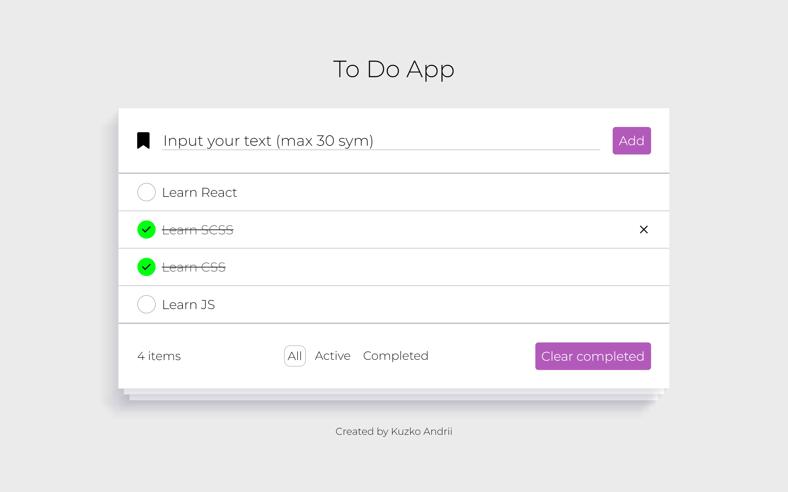

# ToDoApp on JS
For this project I used:
* __HTML__
* __CSS__
* __SCSS__
* __JS__
\
\
This site is not responsive yet. There I manipulated the DOM. \
[Link on this website](https://k-a-webdev.github.io/ToDoAppJS/)

